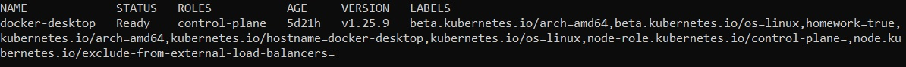
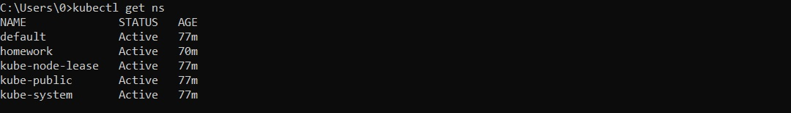
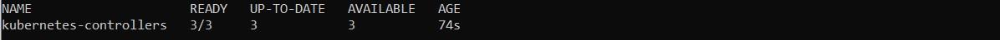
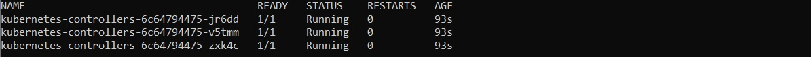
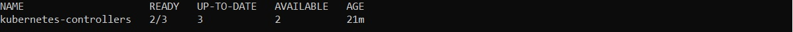
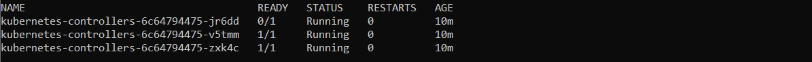

# Развертывание приложения на кластере k8s с помощью deployment

Для выполнения использовался Kubernetes Minikube и утилита kubectl, для которой приведены использованные команды.

## Задача 
- В отдельном namespace homework создать deployment, запускающий 3 экземпляра pod c контейнерами, поднимающим веб-сервер, а также init-контейнерами, генерирующим файл index.html, используемый веб-сервером.
- Контейнеры должны иметь readiness пробу, проверяющую наличие файла /homework/index.html.
- Deployment должен иметь стратегию обновления RollingUpdate, настроенную так, что в процессе обновления может быть недоступен максимум 1 pod.
- Pod должны запускаться только на на нодах кластера, имеющих отметку homework=true.

## Выполнение 
### Создание label для ноды
*kubectl label nodes docker-desktop homework=true*

#### Проверка label
*kubectl get nodes --show-labels*

### Создание namespace
*kubectl apply -f ./manifests/namespace.yaml*

#### Проверка namespace
*kubectl get ns*

### Создание deployment
*kubectl apply -f ./manifests/configmap.yaml*

*kubectl apply -f ./manifests/deployment.yaml*

#### Проверка deployment
*kubectl get deployment -n homework*

*kubectl get pods -n homework*

#### Проверка веб-сервера
*kubectl port-forward deployment/kubernetes-controllers 8080:8000 -n homework*

Далее перейти по ссылке http://localhost:8080/

#### Проверка readiness пробы и доступности deployment
Удалить файл index.html на любом из pod

*kubectl exec -n homework -it kubernetes-controllers-6c64794475-jr6dd --container webserver -- /bin/rm /homework/index.html*

Далее убедиться, что deployment продолжает работу, но статус READY имеют только два pod

*kubectl get deployment -n homework*

*kubectl get pods -n homework*

