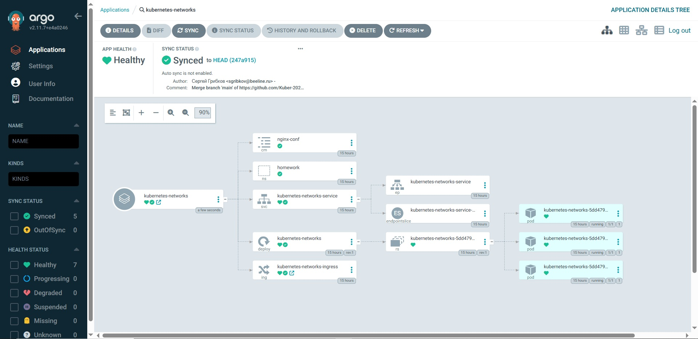

# Реализация GitOps подхода с использованием ArgoCD

Для выполнения использовался managed Kubernetes cluster в Yandex cloud и утилиты kubectl и helm, для которых приведены использованные команды.

## Подготовка окружения
 - Развернуть managed Kubernetes cluster в Yandex cloud
 - Для кластера создать 2 пула нод - для рабочей нагрузки и инфраструктурных сервисов
 - Для инфраструктурных нод добавить taint, запрещающий планирование подов с посторонней нагрузкой - node-role=infra:NoSchedule
 - Установить в кластер с помощью helm-чарта ArgoCD, сконфигурировав параметры установки так, чтобы компоненты ArgoCD устанавливались исключительно на infra-ноды
 - Создать project с именем otus c репозиторием с ДЗ курса в качестве source и кластером, в который установлен ArgoCD

## Задача 1
Создать приложение ArgoCD, использовав репозиторий с приложением из ДЗ kubernetes-networks, со следующими параметрами:
- Sync policy – manual
- Namespace - homework
- Проект – otus
- nodeSelector позволяет установить приложение на одну из нод кластера

## Задача 2
Создать приложение ArgoCD, использовав репозиторий с приложением из ДЗ kubernetes-templating, со следующими параметрами:
- Sync policy – Auto
- AutoHeal – true
- Namespace - homework-helm
- Проект – otus
- nodeSelector позволяет установить приложение на одну из нод кластера
- Параметр, задающий колиùество реплик запускаемого приложения должен переопределяться в конфигурации

## Выполнение
### Подготовка окружения

#### Создание taints и labels на нодах
*kubectl taint nodes <..infrastructure node id..> node-role=infra:NoSchedule*

*kubectl label nodes <..infrastructure node id..> node-role=infra*

*kubectl label nodes <..apps node id..> homework=true*

#### Создание namespace
*kubectl create namespace argocd*

*kubectl create namespace homework*

*kubectl create namespace homework-helm*

#### Установка ingress контроллера
*helm upgrade --install ingress-nginx ingress-nginx --repo https://kubernetes.github.io/ingress-nginx --namespace homework*

#### Установка ArgoCD
*helm pull oci://cr.yandex/yc-marketplace/yandex-cloud/argo/chart/argo-cd --version 7.3.11-2 --untar*

*helm install -f ./manifests/values.yaml argocd ./argo-cd/ --namespace argocd*

#### Создание appproject
*kubectl apply -f ./manifests/appproject.yaml*

#### Доступ к ArgoCD UI
*kubectl port-forward service/argocd-server -n argocd 8080:443*

Логин - admin, пароль получить с помощью команды

*kubectl -n argocd get secret argocd-initial-admin-secret -o jsonpath="{.data.password}" | base64 -d*

Далее открыть в браузере ссылку *http://localhost:8080*, ввести логин и пароль

### Проверка работоспособности
#### Задача 1
*kubectl apply -f ./manifests/application-kubernetes-networks.yaml*

#### Задача 2
*kubectl apply -f ./manifests/application-kubernetes-templating.yaml*

