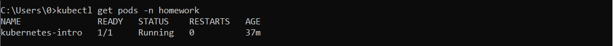

# Запуск локального окружения k8s и простейшего pod в качестве полезной нагрузки

Для выполнения использовался Kubernetes Minikube и утилита kubectl, для которой приведены использованные команды.

## Задача 
В отдельном namespace homework создать pod c контейнером, поднимающим веб-сервер, а также init-контейнером, генерирующим файл index.html, используемый веб-сервером.
При остановке контейнера с веб-сервером файл index.html должен удаляться.

## Выполнение 
### Создание namespace
*kubectl create -f ./namespace.yaml*

#### Проверка namespace
*kubectl get ns*

### Создание pod
*kubectl apply -f ./pod.yaml*

#### Проверка pod
*kubectl get pods -n homework*

*kubectl get pod kubernetes-intro -n homework -o yaml*
