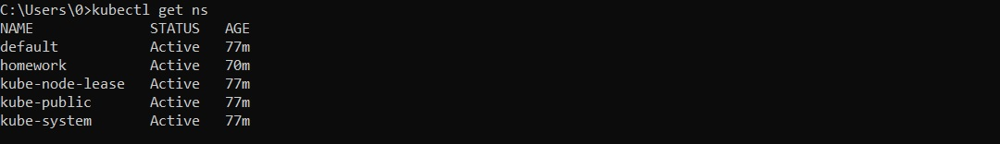
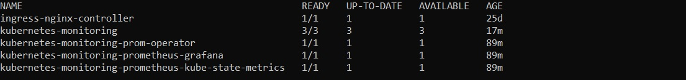
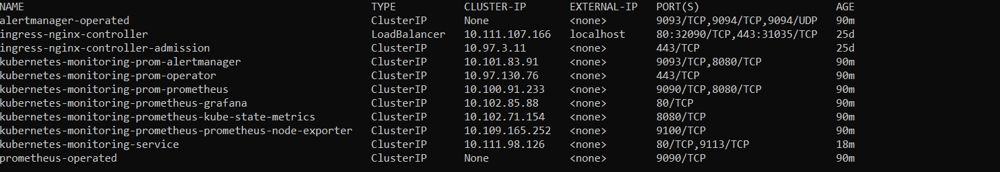
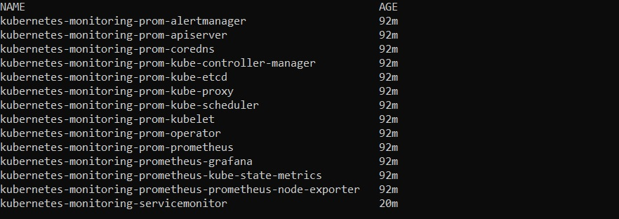
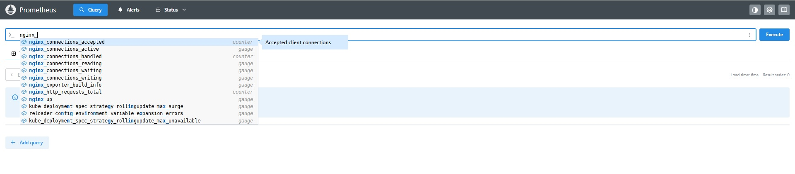
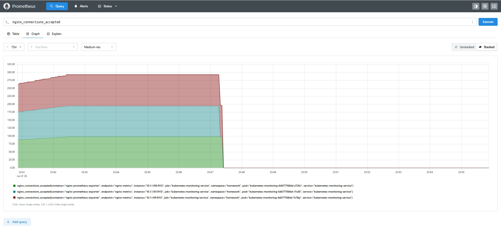

# Мониторинг приложений в кластере k8s

Для выполнения использовался Kubernetes Minikube и утилиты kubectl и helm, для которых приведены использованные команды.

## Задача 
- Установить в кластер Prometheus-operator через helm-чарт
- Cоздать deployment, запускающий 3 экземпляра pod c контейнерами, поднимающим веб-сервер nginx, отдающий свои метрики на определенном endpoint
- Настроить запуск nginx prometheus exporter в составе пода с nginx и сконфигурировать его для сбора метрик с nginx
- Создать манифест service monitor, описывающий сбор метрик с подов с nginx

## Выполнение
### Создание namespace
*kubectl apply -f ./manifests/namespace.yaml*

*kubectl get ns*

### Установка Prometheus-operator через helm-чарт

*helm repo add prometheus-community https://prometheus-community.github.io/helm-charts*

*helm repo update*

*helm install kubernetes-monitoring-prometheus prometheus-community/kube-prometheus-stack --namespace homework*

### Создание deployment
*kubectl apply -f ./manifests/configmap.yaml*

*kubectl apply -f ./manifests/deployment.yaml*

*kubectl get deployment -n homework*

### Создание service
*kubectl apply -f ./manifests/service.yaml*

*kubectl get service -n homework*

### Создание service monitor
*kubectl apply -f ./manifests/serviceMonitor.yaml*

*kubectl get servicemonitor -n homework*

#### Просмотр метрик в Prometheus

Сначала необходимо установить туннель между локальным портом и портом Prometheus

*kubectl port-forward service/kubernetes-monitoring-prom-prometheus 9090:9090 -n homework*

Далее перейти по ссылке http://localhost:9090 и выбрать метрики с префиксом nginx

Далее просмотреть одну из метрик, например, в виде диаграммы

