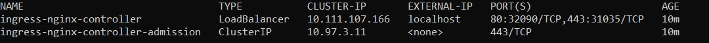
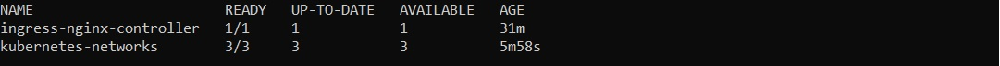
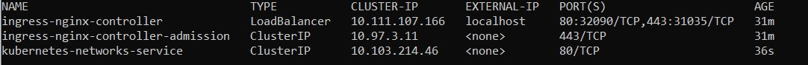

# Обеспечение сетевого взаимодействия pod на кластере k8s с помощью service и ingress

Для выполнения использовался Kubernetes Minikube и утилиты kubectl, helm и curl, для которых приведены использованные команды.

## Задача 
- В отдельном namespace homework создать deployment, запускающий 3 экземпляра pod c контейнерами, поднимающим веб-сервер, а также init-контейнерами, генерирующим файл index.html, используемый веб-сервером.
- Контейнеры должны иметь readiness пробу, вызывающую URL /index.html.
- Создать service типа ClusterIP, направляющий трафик на поды, управляемые deployment.
- Создать объект типа ingress, направляющий все http запросы к хосту homework.otus на service 

## Выполнение 
### Установка ingress контроллера
*helm upgrade --install ingress-nginx ingress-nginx --repo https://kubernetes.github.io/ingress-nginx --namespace homework*

#### Проверка ingress контроллера
*kubectl get service -n homework*

### Создание namespace
*kubectl apply -f ./manifests/namespace.yaml*

#### Проверка namespace
*kubectl get ns*

### Создание deployment
*kubectl apply -f ./manifests/configmap.yaml*

*kubectl apply -f ./manifests/deployment.yaml*

#### Проверка deployment
*kubectl get deployment -n homework*

### Создание service
*kubectl apply -f ./manifests/service.yaml*

#### Проверка service
*kubectl get service -n homework*

### Создание ingress
*kubectl apply -f ./manifests/ingress.yaml*

#### Проверка ingress
*kubectl get ingress -n homework*

#### Проверка http-запросов к хосту homework.otus

Сначала необходимо добавить в файл /etc/hosts строку 127.0.0.1 homework.otus

Далее перейти по ссылке http://homework.otus или отправить get запрос с помощью утилиты curl

*curl http://homework.otus/*

