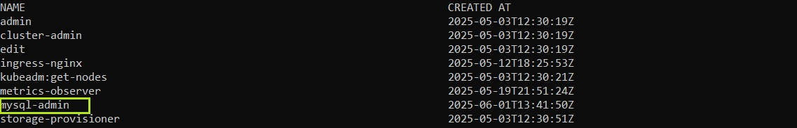
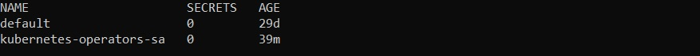
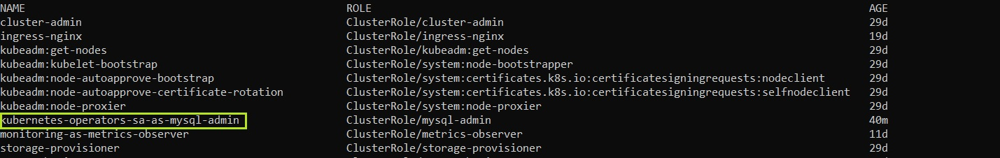
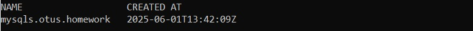
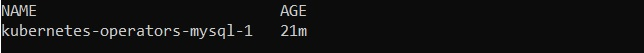
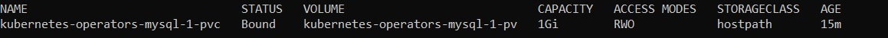
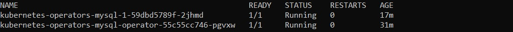
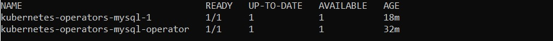
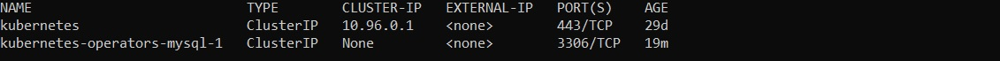

# Создание собственного custom resource definition

Для выполнения использовался Kubernetes Minikube и утилиты kubectl, для которой приведены использованные команды.

## Задача 
- Создать custom resource definition объекта со следующими параметрами:
    - объект уровня namespace
    - api group – otus.homework
    - kind – MySQL
    - plural name – mysqls
    - версия – v1
- Объект должен иметþ следующие обязательные атрибуты и правила их валидации (все поля строковые):
    - image – определет docker-образ длā созданиā
    - database – имя базы данных
    - password – пароль от БД
    - storage_size – размер хранилища под базу
- Создать манифесты ServiceAccount, ClusterRole и ClusterRoleBinding, описывающие сервис аккаунт с правами доступа, необходимыми для созданного custom resource definition
- Создать манифест deployment длā оператора, указав созданный ранее ServiceAccount и образ roflmaoinmysoul/mysql-operator:1.0.0
- Создать манифест кастомного объекта kind: MySQL валидный для применения
- Применить все манифесты и убедиться, что custom resource definition создался, оператор работает и при создании кастомного ресурса типа MySQL создает Deployment с указаннýм образом mysql, service длā него, PV и PVC. 
  При удалении объекта типа MySQL удаляются все созданные для него ресурсы.

## Выполнение 
### Создание cluster role
*kubectl apply -f ./manifests/clusterrole.yaml*

*kubectl get clusterrole*

### Создание service account
*kubectl apply -f ./manifests/serviceaccountg.yaml*

*kubectl get serviceaccount -n default*

### Создание cluster role binding
*kubectl apply -f ./manifests/clusterrolebinding.yaml*

*kubectl get clusterrolebinding -n default*

### Создание custom resource definition
*kubectl apply -f ./manifests/mysql-resourcedefinition.yaml*

*kubectl get crd*

### Создание deployment для оператора

*kubectl apply -f ./manifests/deployment.yaml*

*kubectl get deployment -n homework*

### 

### Проверка работы оператора с custom resource definition при создании инстанса MySQL 
*kubectl apply -f ./manifests/mysql.yaml*

*kubectl get mysql -n default*

*kubectl get pv*

*kubectl get pvc -n default*

*kubectl get pod -n default*

*kubectl get deployment -n default*

*kubectl get service -n default*

