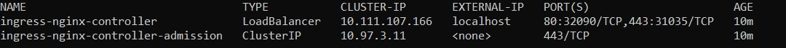
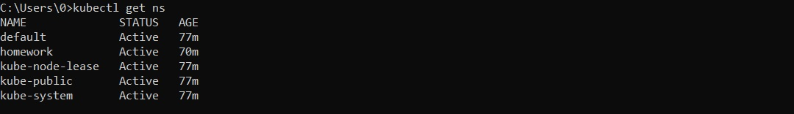

# Настройка service account на кластере k8s и ограничение прав для них 

Для выполнения использовался Kubernetes Minikube и утилиты kubectl, helm и curl, для которых приведены использованные команды.

## Задача 
- В отдельном namespace homework создать service account monitoring и дать ему доступ к эндпоинту /metrics кластера
- Создать deployment, запускающий под service account monitoring 3 экземпляра pod c контейнерами, поднимающим веб-сервер, а также init-контейнерами, генерирующим файл index.html, используемый веб-сервером.
- Контейнеры должны иметь readiness пробу, вызывающую URL /index.html.
- Создать service типа ClusterIP, направляющий трафик на поды, управляемые deployment.
- Создать объект типа ingress, направляющий все http запросы к хосту homework.otus на service
- Создать service account monitoring и дать ему доступ к эндпоинту /metrics кластера
- В процессе запуска pod с deployment должно происходить обращение к эндпоинту /metric кластера, результат ответа должен сохраняться в файл metrics.html, доступный по адресу http://homework.otus/metrics.html
- Создать service account cd и дать ему роль admin в рамках namespace homework
- Создать kubeconfig для service account cd
- Сгенерировать токен с временем действия 1 день для service account cd и сохранить его в файл token

## Выполнение 
### Установка ingress контроллера
*helm upgrade --install ingress-nginx ingress-nginx --repo https://kubernetes.github.io/ingress-nginx --namespace homework*

*kubectl get service -n homework*

### Создание namespace
*kubectl apply -f ./manifests/namespace.yaml*

*kubectl get ns*

### Создание cluster role
*kubectl apply -f ./manifests/cr-metrics-observer.yaml*

*kubectl get clusterrole*

### Создание service account
*kubectl apply -f ./manifests/sa-monitoring.yaml*

*kubectl apply -f ./manifests/sa-cd.yaml*

*kubectl get serviceaccount -n homework*

### Создание cluster role binding
*kubectl apply -f ./manifests/crb-monitoring.yaml*

*kubectl get clusterrolebinding -n homework*

### Создание role binding
*kubectl apply -f ./manifests/rb-cd.yaml*

*kubectl get rolebinding -n homework*

### Создание token для service account
*kubectl create token cd --namespace homework --duration 24h > token*

### Создание deployment
*kubectl apply -f ./manifests/configmap.yaml*

*kubectl apply -f ./manifests/deployment.yaml*

*kubectl get deployment -n homework*

### Создание service
*kubectl apply -f ./manifests/service.yaml*

*kubectl get service -n homework*

### Создание ingress
*kubectl apply -f ./manifests/ingress.yaml*

*kubectl get ingress -n homework*

### Проверка настроек service account

#### Sevrice account 'monitoring'
Для проверки запуска deployment под service account необходимо получить описание любого его pod

*kubectl describe pod kubernetes-security-<...> -n homework | grep "Service Account"*

Для проверки полученных метрик клстера сначала необходимо добавить в файл /etc/hosts строку "127.0.0.1 homework.otus"

Далее перейти по ссылке http://homework.otus/metrics.html или отправить get запрос с помощью утилиты curl

*curl http://homework.otus/metrics.html*

#### Sevrice account 'cd'

*kubectl --kubeconfig=./manifests/cd-kubeconfig.yaml get pods -n homework*

