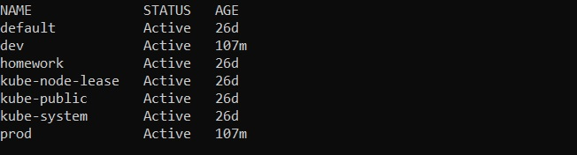
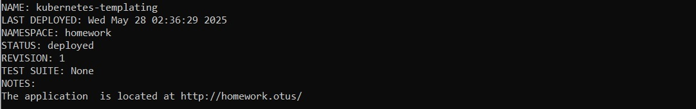
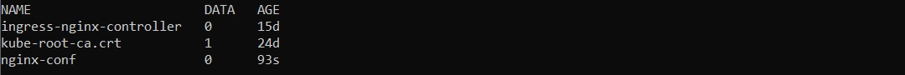
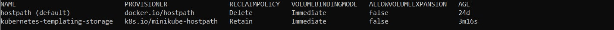
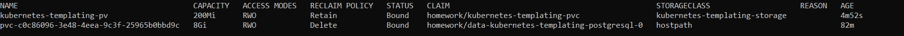
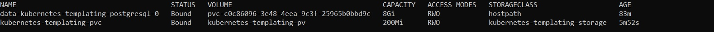
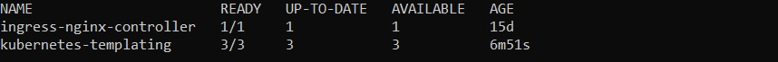
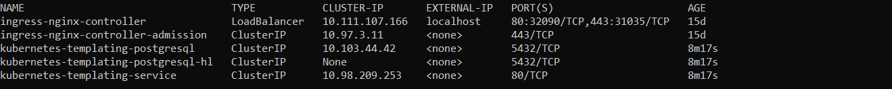
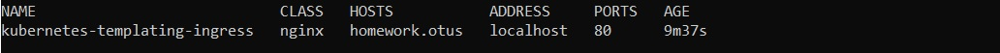

# Шаблонизация манифестов приложения, использование Helm. Установка community Helm charts

Для выполнения использовался Kubernetes Minikube и утилиты kubectl, helm и curl, для которых приведены использованные команды.

## Задача 1
Создать helm-chart, позволяющее деплоить следующее приложение в namespace homework и включающее следующие компоненты:
- storage сlass с provisioner https://k8s.io/minikube-hostpath и reclaimPolicy Retain
- persistent volume и persistent volume claim, запрашивающие хранилище созданного storage сlass.
- deployment, запускающий под service account monitoring 3 экземпляра pod c контейнерами, поднимающим веб-сервер, а также init-контейнерами, генерирующим файл index.html, используемый веб-сервером. 
  Контейнеры должны включать readiness пробу, вызывающую URL /index.html, включаемую/отулючаемую через конфиг. 
  Файл index.html должен размещаться в persistent volume, монтируемый в init и основной контейнер
- service типа ClusterIP, направляющий трафик на поды, управляемые deployment.
- ingress, направляющий все http запросы к хосту homework.otus на service
- notes с описанием сообщения после установки релиза, отображающее адрес, по которому можно обратиться к сервису
- сервис-зависимость из доступных community чартов

## Задача 2
Установить kafka из bitnami helm-чарта используя helmfile, описав 2 сценария установки:
#### Prod
- Установлен в namespace prod
- Должно быть развернуто 5 брокеров
- Должна быть установлена kafka версии 3.5.2
- Для клиентских и межброкерных взаимодействий должен использоваться протокол SASL_PLAINTEXT
#### Dev
- Установлен в namespace dev
- Должен быть развернут 1 брокер
- Должна быть установлена последняя доступная версия kafka
- Для клиентских и межброкерных взаимодействий должен использоваться протокол PLAINTEXT, авторизация для подключения к кластеру отключена

## Выполнение 

### Установка ingress контроллера
*helm upgrade --install ingress-nginx ingress-nginx --repo https://kubernetes.github.io/ingress-nginx --namespace homework*

### Создание namespace

*kubectl apply -f ./manifests/namespace.yaml*

*kubectl get ns*

### Задача 1
#### Развертывание
*helm dependency update ./helmcharts/kubernetes-templating*

*helm install kubernetes-templating ./helmcharts/kubernetes-templating --namespace homework*

*kubectl get configmap -n homework*

*kubectl get sc*

*kubectl get pv*

*kubectl get pvc -n homework*

*kubectl get deployment -n homework*

*kubectl get service -n homework*

*kubectl get ingress -n homework*

#### Проверка работоспособности
Сначала необходимо добавить в файл /etc/hosts строку "127.0.0.1 homework.otus"

Далее перейти по ссылке http://homework.otus/ или отправить get запрос с помощью утилиты curl

*curl http://homework.otus/*

### Задача 2
#### Развертывание

