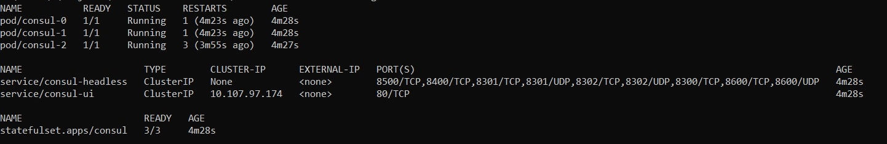
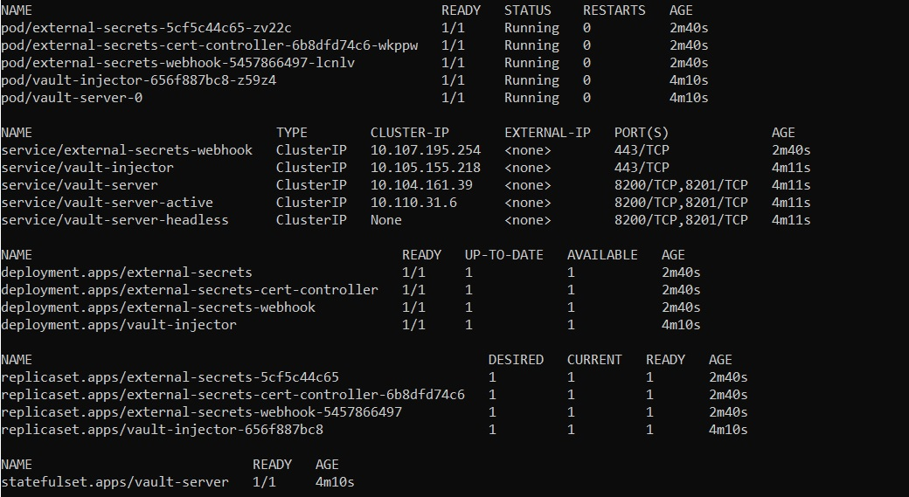
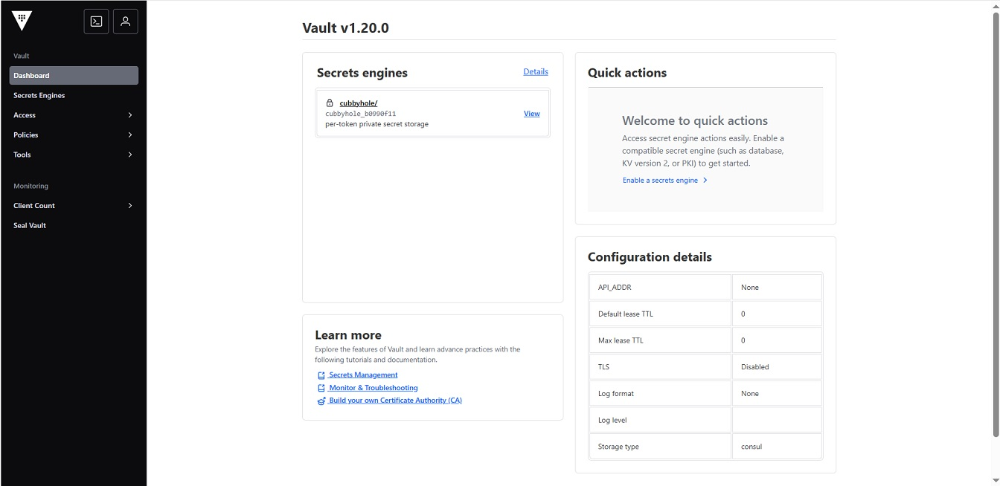
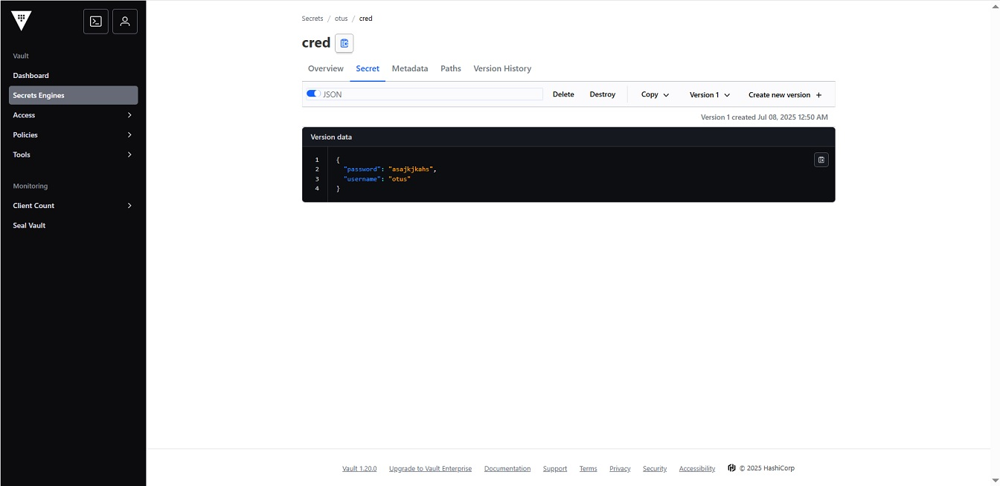
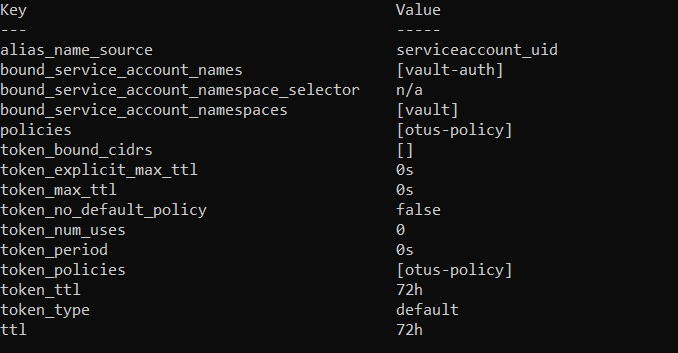
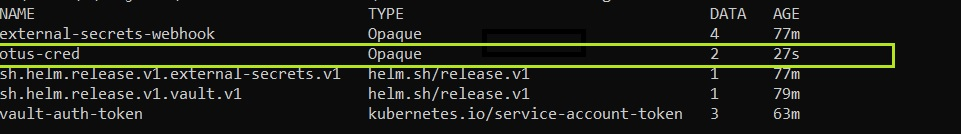
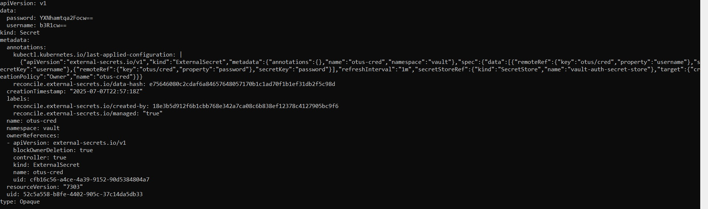

# Хранилище секретов для приложения. Vault.

Для выполнения использовался managed Kubernetes cluster в Yandex cloud и утилиты kubectl и helm, для которых приведены использованные команды.

## Подготовка окружения
 - В namespace consul установить consul из helm-чарта с параметрами 3 реплики для сервера
 - В namespace vault установите hashicorp vaultиз helm-чарта, сконфигурировав установку для использования ранее установленного consul в HA режиме
 - Выполнить инициализацию vault и распечатать все поды хранилища с помощью полученного unseal key 
 - Установить external secrets operator из helm-чарта в namespace vault

## Задача
- Создать хранилище секретов otus/ с Secret Engine KV, а в нем секрет otus/cred, содержащий username='otus' password='asajkjkahs’
- В namespace vault создать serviceAccount с именем vault-auth и ClusterRoleBinding для него с ролью system:auth-delegator
- В Vault включить авторизацию auth/kubernetes и сконфигурировать ее используя токен и сертификат ранее созданного ServiceAccount
- Создать и применить политику otus-policy для секретов /otus/cred с capabilities = [“read”, “list”]
- Создать роль auth/kubernetes/role/otus в vault с использованием ServiceAccount vault-auth из namespace Vault и политикой otus-policy
- Создать и применить манифест crd объекта SecretStore в namespace vault, сконфигурированный для доступа к KV секретам Vault с использованием ранее созданной роли otus и сервис аккаунта vault-auth
- Создать и применить манифест crd объекта ExternalSecret со следующими параметрами:
  - namespace – vault
  - SecretStore – созданнýй на прошлом шаге
  - Target.name = otus-cred
  - Получает значения KV секрета /otus/cred из vault и отображает их в два ключа – username и password соответственно
- Убедиться, что после применения ExternalSecret будет создан Secret в namespace vault с именем otus-cred и хранящий в себе 2 ключа username и password, со значениями, которые были сохранены ранее в vault

## Выполнение
### Подготовка окружения

#### Создание namespace
*kubectl create namespace consul*

*kubectl create namespace vault*

#### Установка consul
*helm install -f ./manifests/consul-values.yaml consul oci://registry-1.docker.io/bitnamicharts/consul --namespace consul*

*kubectl get all -n consul*

#### Установка vault и external secrets operator
*helm install -f ./manifests/vault-values.yaml vault oci://registry-1.docker.io/bitnamicharts/vault --namespace vault*

*helm repo add external-secrets https://charts.external-secrets.io*

*helm install external-secrets external-secrets/external-secrets --namespace vault*

#### Инициализация и распечатка vault
*kubectl exec -ti pod/vault-server-0 -n vault -- vault operator init -key-shares=1 -key-threshold=1*

Далее сохранить выведенные на экран unseal key и initial root token

*kubectl exec -ti pod/vault-server-0 -n vault -- vault operator unseal*

Далее ввести полученный ранее unseal key

#### Доступ vault UI
*kubectl port-forward service/vault-server 8200:8200 -n vault*

Далее открыть в браузере ссылку *http://localhost:8200*, и ввести полученный ранее initial root token

### Настройка интеграции секретов vault в kubernetes
#### Создание секретов в vault
*kubectl exec -ti pod/vault-server-0 -n vault -- vault login*

Далее ввести полученный ранее initial root token

*kubectl exec -ti pod/vault-server-0 -n vault -- vault secrets enable -path=otus kv-v2*

*kubectl exec -ti pod/vault-server-0 -n vault -- vault kv put otus/cred username="otus" password="asajkjkahs"*

#### Создание service account kubernetes

*kubectl apply -f ./manifests/sa-vault-auth.yaml*

*kubectl apply -f ./manifests/secret-vault-auth.yaml*

*kubectl apply -f ./manifests/crb-vault-auth.yaml*

#### Настройка авторизации kubernetes в vault

*kubectl exec -ti pod/vault-server-0 -n vault -- vault auth enable kubernetes*

*export KUBERNETES_HOST=$(kubectl config view --minify --output jsonpath="{.clusters[*].cluster.server}")*

*export VAULT_AUTH_TOKEN=$(kubectl get secret vault-auth-token -n vault -o jsonpath="{.data.token"}  | base64 --decode)*

*kubectl exec -ti pod/vault-server-0 -n vault -- vault write auth/kubernetes/config token_reviewer_jwt=$VAULT_AUTH_TOKEN kubernetes_host=$KUBERNETES_HOST kubernetes_ca_cert=@/var/run/secrets/kubernetes.io/serviceaccount/ca.crt*

#### Создание роли для авторизации kubernetes в vault

*kubectl cp ./manifests/otus-policy.hcl vault/vault-server-0:/bitnami/vault/data -c server*

*kubectl exec -ti pod/vault-server-0 -n vault -- vault policy write otus-policy /bitnami/vault/data/otus-policy.hcl*

*kubectl exec -ti pod/vault-server-0 -n vault -- vault write auth/kubernetes/role/otus bound_service_account_names="vault-auth" bound_service_account_namespaces="vault" policies="otus-policy" ttl="72h"*

*kubectl exec -ti pod/vault-server-0 -n vault -- vault read auth/kubernetes/role/otus*

#### Синхронизация секретов vault и kubernetes с помощью external secrets operator

*kubectl apply -f ./manifests/vault-auth-secret-store.yaml*

*kubectl apply -f ./manifests/vault-auth-external-secret.yaml*

### Проверка работоспособности
*kubectl get secrets -n vault*

*kubectl get secret otus-cred -n vault -o yaml*

*kubectl get secret otus-cred -n vault -o jsonpath="{.data.username"}  | base64 --decode*

*kubectl get secret otus-cred -n vault -o jsonpath="{.data.password"}  | base64 --decode*