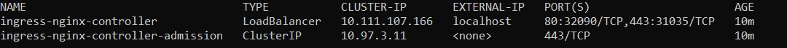
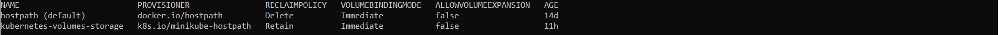
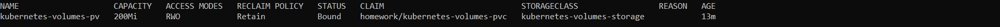
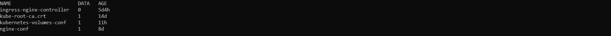
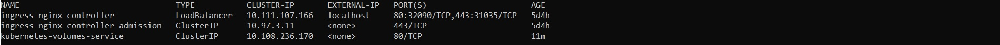
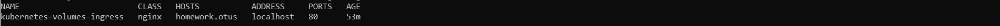

# Обеспечение работы deployment с данными на кластере k8s с помощью configmap, storage class, persistent volume и persistent volume claim

Для выполнения использовался Kubernetes Minikube и утилиты kubectl, helm и curl, для которых приведены использованные команды.

## Задача 
- В отдельном namespace homework создать storage сlass с provisioner https://k8s.io/minikube-hostpath и reclaimPolicy Retain
- Создать persistent volume claim, запрашивающий хранилище созданного storage сlass
- Создать configmap, описывающий произвольный набор пар ключ - значение
- Создать deployment, запускающий 3 экземпляра pod c контейнерами, поднимающим веб-сервер, а также init-контейнерами, генерирующим файл index.html, используемый веб-сервером.
- Файл index.html должен размещаться в persistent volume, монтируемый в init и основной контейнер
- Добавить в deployment монтирование ранее созданного configmap как volume к основному контейнеру пода в директории /homework/conf, так, чтобы его содержимое можно было получить, обратившись по url /conf/file
- Контейнеры должны иметь readiness пробу, вызывающую URL /index.html.
- Создать service типа ClusterIP, направляющий трафик на поды, управляемые deployment.
- Создать объект типа ingress, направляющий http запросы к хосту homework.otus на service 

## Выполнение 
### Установка ingress контроллера
*helm upgrade --install ingress-nginx ingress-nginx --repo https://kubernetes.github.io/ingress-nginx --namespace homework*

*kubectl get service -n homework*

### Создание namespace
*kubectl apply -f ./manifests/namespace.yaml*

*kubectl get ns*

### Создание storage class
*kubectl apply -f ./manifests/storageClass.yaml*

*kubectl get sc*

### Создание persistent volume
*kubectl apply -f ./manifests/pv.yaml*

*kubectl get pv*

### Создание persistent volume claim
*kubectl apply -f ./manifests/pvc.yaml*

*kubectl get pvc -n homework*

### Создание configmap
*kubectl apply -f ./manifests/configmap.yaml*

*kubectl apply -f ./manifests/cm.yaml*

*kubectl get configmap -n homework*

### Создание deployment
*kubectl apply -f ./manifests/deployment.yaml*

*kubectl get deployment -n homework*

### Создание service
*kubectl apply -f ./manifests/service.yaml*

*kubectl get service -n homework*

### Создание ingress
*kubectl apply -f ./manifests/ingress.yaml*

*kubectl get ingress -n homework*

### Проверка http-запроса к хосту homework.otus для получения данных configmap

Сначала необходимо добавить в файл /etc/hosts строку "127.0.0.1 homework.otus"

Далее перейти по ссылке http://homework.otus/conf/file.json или отправить get запрос с помощью утилиты curl

*curl http://homework.otus/conf/file.json*

